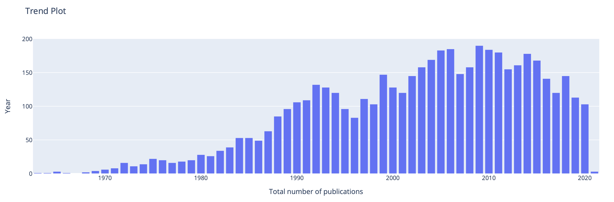

# Computer Science Academic World Web Application

**Title**:
  FindYourGroup

**Purpose**:
  The primary objective of FindYourGroup is to assist undergraduate students in identifying their ideal research group for graduate study. The graduate study application process is crucial for every undergraduate student, and the most critical aspect of this process is determining the most suitable university and research group to pursue their academic goals.

**Demo**: Link to the demo: https://mediaspace.illinois.edu/media/t/1_as37ps1p or

https://drive.google.com/file/d/1jAsCSHsPJhegFq5Y-2ULe7iRfxHrnxPB/view?usp=share_link. Read the video demo section below to understand what contents are expected in your demo.

**Installation**:
  To install and run the Computer Science Academic World Web Application, follow these steps:
1. Clone the repository to your local machine.
2. Install Python, MySQL, Neo4j, MongoDB if they are not already installed.
3. Create the Databases and start database servers.
4. Install the required Python packages by running the following command: pip install -r requirements.txt
5. Start the application by running the following command: `python app.py` and enter credentials.
6. Open a web browser and navigate to http://127.0.0.1:8050 to access the application.

**Usage**:
  FindYourGroup is a user-friendly tool that simplifies the search process for universities and faculty members based on given keywords. Utilizing the academicworld database, FindYourGroup offers users access to the popularity trend of various research topics, enabling them to identify promising and intriguing areas of research. Once the user has identified their desired topic(s), the tool assists in finding the ideal university and research group by considering factors such as related publications, collaboration networks, and keyword-relevant citations.

**Design**:
  FindYourGroup consists of four sections:

  The initial section displays a histogram that illustrates the trend of popularity for a given topic, showing the number of related publications for each year.

  The second segment is designed to assist users in identifying suitable universities for their graduate applications. To facilitate this decision, FindYourGroup presents a table indicating the number of faculty members involved in researching the related topic for each university. Additionally, the tool provides helpful information about the research environment of a university, such as the top 10 popular topics and potential collaboration networks, which can help users determine their ideal institution.

  In addition to selecting a university, selecting a research group or faculty is also crucial when applying for graduate studies. The third section of FindYourGroup aims to aid users in identifying an appropriate research group by providing the top 10 highest keyword-relevant citation (KRC) scores for influential faculty members. For each faculty member, this section also displays the number of publications and trend for the given topic.

  Lastly, the tool offers a feature for universities and faculty members to update the database regularly, enabling FindYourGroup to remain current and better assist users with their graduate study applications.

**Implementation**:
  FindYourGroup uses
    mysql.connector, pymongo, neo4j and py2neo to access the academicworld database;
    numpy and pandas to manipulate and analyze the data;
    dash, JupyterDash and plotly to report the analysis result.

**Database Techniques**:

  Python: The frontend of the application is built using Python and Dash.
  MySQL: The data is stored in a MySQL database.
  NEO4J: The data is stored in a NEO4J database.
  mongodb: The data is stored in a MySQL mongodb.

  To implemente FindYourGroup, we use
    View to provide a virtual table that is based on the result of a SELECT statement;
    Indexing to fasten searching and retrieval of data;
    Constraint and Trigger to search and update the data.

**Contributions**:
  Xu Yi: First 3 widgets; 20 h
  Chengming He: The Other 3 widgets and updates : 20 h
